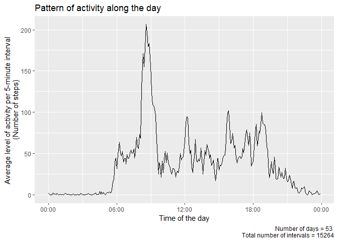

 

 

------------------------------------------------------------------------

### R version and required packages

For this project, I have used R version 4.0.0 and the following
packages:  
(from the latest to the first attached, along with their version
numbers).

<table>
<thead>
<tr class="header">
<th style="text-align: left;">Packages</th>
<th style="text-align: left;">Versions</th>
</tr>
</thead>
<tbody>
<tr class="odd">
<td style="text-align: left;">chron</td>
<td style="text-align: left;">2.3.55</td>
</tr>
<tr class="even">
<td style="text-align: left;">scales</td>
<td style="text-align: left;">1.1.0</td>
</tr>
<tr class="odd">
<td style="text-align: left;">stringr</td>
<td style="text-align: left;">1.4.0</td>
</tr>
<tr class="even">
<td style="text-align: left;">knitr</td>
<td style="text-align: left;">1.28</td>
</tr>
<tr class="odd">
<td style="text-align: left;">markdown</td>
<td style="text-align: left;">1.1</td>
</tr>
<tr class="even">
<td style="text-align: left;">forcats</td>
<td style="text-align: left;">0.5.0</td>
</tr>
<tr class="odd">
<td style="text-align: left;">ggplot2</td>
<td style="text-align: left;">3.3.0</td>
</tr>
<tr class="even">
<td style="text-align: left;">finalfit</td>
<td style="text-align: left;">1.0.1</td>
</tr>
<tr class="odd">
<td style="text-align: left;">lubridate</td>
<td style="text-align: left;">1.7.8</td>
</tr>
<tr class="even">
<td style="text-align: left;">data.table</td>
<td style="text-align: left;">1.12.8</td>
</tr>
<tr class="odd">
<td style="text-align: left;">dplyr</td>
<td style="text-align: left;">0.8.5</td>
</tr>
<tr class="even">
<td style="text-align: left;">reader</td>
<td style="text-align: left;">1.0.6</td>
</tr>
<tr class="odd">
<td style="text-align: left;">NCmisc</td>
<td style="text-align: left;">1.1.6</td>
</tr>
<tr class="even">
<td style="text-align: left;">readr</td>
<td style="text-align: left;">1.3.1</td>
</tr>
<tr class="odd">
<td style="text-align: left;">downloader</td>
<td style="text-align: left;">0.4</td>
</tr>
<tr class="even">
<td style="text-align: left;">stats</td>
<td style="text-align: left;">4.0.0</td>
</tr>
<tr class="odd">
<td style="text-align: left;">graphics</td>
<td style="text-align: left;">4.0.0</td>
</tr>
<tr class="even">
<td style="text-align: left;">grDevices</td>
<td style="text-align: left;">4.0.0</td>
</tr>
<tr class="odd">
<td style="text-align: left;">utils</td>
<td style="text-align: left;">4.0.0</td>
</tr>
<tr class="even">
<td style="text-align: left;">datasets</td>
<td style="text-align: left;">4.0.0</td>
</tr>
<tr class="odd">
<td style="text-align: left;">methods</td>
<td style="text-align: left;">4.0.0</td>
</tr>
<tr class="even">
<td style="text-align: left;">base</td>
<td style="text-align: left;">4.0.0</td>
</tr>
</tbody>
</table>

 

 

------------------------------------------------------------------------

### 1) Loading and preprocessing the data

 

**TASK 1.1. Load the data**

    activity<-read.csv("activity.csv")
    str(activity)

    ## 'data.frame':    17568 obs. of  3 variables:
    ##  $ steps   : int  NA NA NA NA NA NA NA NA NA NA ...
    ##  $ date    : chr  "2012-10-01" "2012-10-01" "2012-10-01" "2012-10-01" ...
    ##  $ interval: int  0 5 10 15 20 25 30 35 40 45 ...

 

**TASK 1.2. Process/transform the data**  
We need to convert the format of the dates from ‘chr’ to ‘Date’.

    activity%>%
            rename(date_str=date) %>% #rename the string variable 'date' as 'date_str'
            mutate(date=ymd(date_str)) %>% #create the variable 'date' formatted as a date
            select(steps,date,interval)->activity #drop the string variable 'date_str'

The variable ‘interval’ contains information on the time of the day (in
hours and minutes) at which the measurements were done, but the format
(integer) is not appropriate and is not easy to read.

    * There is no separation between hours and minutes  
    * The number of digits varies between 1 and 4, because there are no leading zeros for hours (before 10:00AM) and for minutes (before 00:10AM).  

Let’s start by converting it to ‘chr’ and adding leading zeros to obtain
a consistant 4-digit format.

    # The variable is converted from 'int' to 'chr'
    activity$interval<-as.character(activity$interval)

    # We calculate the number of values with less than 4 digits
    not4digits<-sum(!grepl("^([0-9]{4})",activity$interval))

    # We use this loop to add leading zeros to the values with less than 4 digits.
    while(not4digits>0){
            activity$interval[!grepl("^([0-9]{4})",activity$interval)]<-paste("0",activity$interval[!grepl("^([0-9]{4})",activity$interval)],sep="")
            not4digits<-sum(!grepl("^([0-9]{4})",activity$interval)) # Nr of values with <4 digits recalculated
    }

We will now separate hours and minutes and use the resulting ‘chr’
variable to create a new ‘times’ variable: ‘interval\_t’.

    # We extract the hours (encoded in the first two digits)
    activity$hh<-unlist(str_match_all(activity$interval,"^[0-9][0-9]"))

    # We extract the minutes (encoded in the last two digits)
    activity$mm<-unlist(str_match_all(activity$interval,"[0-9][0-9]$"))

    # We use these two variables to create a new character variable containing the time (HH:MM)
    # and a new 'times' variable (HH:MM:SS, package 'chron') that allows encoding times without dates.
    activity%>%
            mutate(interval_chr=paste(hh,mm,sep=":"))%>%
            mutate(interval_t=times(paste0(interval_chr, ":00")))%>% # 'chron' package 
            select(-c(hh,mm))->activity # We discard the variables for hours and minutes

    str(activity)

    ## 'data.frame':    17568 obs. of  5 variables:
    ##  $ steps       : int  NA NA NA NA NA NA NA NA NA NA ...
    ##  $ date        : Date, format: "2012-10-01" "2012-10-01" "2012-10-01" "2012-10-01" ...
    ##  $ interval    : chr  "0000" "0005" "0010" "0015" ...
    ##  $ interval_chr: chr  "00:00" "00:05" "00:10" "00:15" ...
    ##  $ interval_t  : 'times' num  00:00:00 00:05:00 00:10:00 00:15:00 00:20:00 ...
    ##   ..- attr(*, "format")= chr "h:m:s"

The data are now in the appropriate formats and are ready for analysis.

 

 

------------------------------------------------------------------------

### 2) What is mean total number of steps taken per day?

 

**TASK 2.1. Calculate the total number of steps taken per day**

    activity%>%
            group_by(date)%>%
            summarise(steps=sum(steps))->dailyActivity
    dailyActivity<-as.data.frame(dailyActivity)

    str(dailyActivity)

    ## 'data.frame':    61 obs. of  2 variables:
    ##  $ date : Date, format: "2012-10-01" "2012-10-02" "2012-10-03" "2012-10-04" ...
    ##  $ steps: int  NA 126 11352 12116 13294 15420 11015 NA 12811 9900 ...

    head(dailyActivity)

    ##         date steps
    ## 1 2012-10-01    NA
    ## 2 2012-10-02   126
    ## 3 2012-10-03 11352
    ## 4 2012-10-04 12116
    ## 5 2012-10-05 13294
    ## 6 2012-10-06 15420

 

**TASK 2.2. Make a histogram of the total number of steps taken each
day**

    nrNA<-sum(!complete.cases(dailyActivity))
    nrN<-sum(complete.cases(dailyActivity))
    hist(dailyActivity$steps,ylim=c(0,40),
         main="Distribution of daily activity \n (without imputation)",
         xlab="Number of steps",ylab="Frequency")
    par(adj = 0) #left justification for the note below
    title(sub=paste("N=",nrN, ", NA=",nrNA))

The distribution is more or less symmetrical. The step count fell
between 10,000 and 15,000 more often than not. There is no data for 8 of
the 61 days.

 

**TASK 2.3. Calculate and report the mean and median of the total number
of steps taken per day**

    (dailyActivity_summary<-summary(dailyActivity$steps))

    ##    Min. 1st Qu.  Median    Mean 3rd Qu.    Max.    NA's 
    ##      41    8841   10765   10766   13294   21194       8

The mean number of steps per day was 10766, the median was 10765.

 

 

------------------------------------------------------------------------

### 3) What is the average daily activity pattern?

 

**TASK 3.1. Make a time series plot of the 5-minute interval (x-axis)
and the average number of steps taken, averaged across all days
(y-axis)**

Prepare the data

    activity%>%
            group_by(interval_t)%>%
            summarise(steps_mean=mean(steps,na.rm=TRUE))->intervalActivity
    intervalActivity<-as.data.frame(intervalActivity)

    str(intervalActivity)

    ## 'data.frame':    288 obs. of  2 variables:
    ##  $ interval_t: 'times' num  00:00:00 00:05:00 00:10:00 00:15:00 00:20:00 ...
    ##   ..- attr(*, "format")= chr "h:m:s"
    ##  $ steps_mean: num  1.717 0.3396 0.1321 0.1509 0.0755 ...

    head(intervalActivity)

    ##   interval_t steps_mean
    ## 1   00:00:00  1.7169811
    ## 2   00:05:00  0.3396226
    ## 3   00:10:00  0.1320755
    ## 4   00:15:00  0.1509434
    ## 5   00:20:00  0.0754717
    ## 6   00:25:00  2.0943396

Plot the data

    ## plot
    Nobs<-sum(complete.cases(activity))
    Ndays<-nrow(dailyActivity[!is.na(dailyActivity$steps),]) #number of days with complete data

    g<-ggplot(intervalActivity,aes(interval_t,steps_mean))+
            geom_line()+
            ggtitle("Pattern of activity along the day")+
            xlab("Time of the day")+
            ylab("Average level of activity per 5-minute interval \n(Number of steps)")+
            labs(caption=paste("Number of days =", Ndays,"\nTotal number of intervals =", Nobs))+
            scale_x_chron(format="%H:%M")
    g

The figure shows a large peak in the morning followed by smaller peaks
in the afternoon.

 

**TASK 3.2. Which 5-minute interval, on average across all the days in
the dataset, contains the maximum number of steps?**

To Answer that question, we will look in the ‘intervalActivity’ dataset
and extract the row with the highest average number of steps

    intervalActivity[intervalActivity$steps_mean==max(intervalActivity$steps_mean),]

    ##     interval_t steps_mean
    ## 104   08:35:00   206.1698

The highest average number of steps was 206 and occurred during the
interval between 8:35 and 8:40 AM.

 

 

------------------------------------------------------------------------

### 4) Imputting missing values

 

**TASK 4.1 Calculate and report the total number of missing values in
the dataset**

    # Number of rows with missing data
    sum(!complete.cases(activity)) 

    ## [1] 2304

 

**TASK 4.2 Devise a strategy for filling in all of the missing values in
the dataset.** We will first explore how the missing values are
distributed.

    # Proportion of rows with missing data on 'steps'.
    sum(is.na(activity$steps))/length(activity$steps)

    ## [1] 0.1311475

    activity%>%
            select(-interval)%>%
            missing_plot()

    activity%>%
            group_by(date)%>%
            summarise(steps=sum(steps),stepsNArm=sum(steps, na.rm = TRUE))%>% #The value in the first column will be NA if there are NAs that day, The value in the second column will be the total number of steps that day, ignoring the NAs
            filter(is.na(steps))%>%
            mutate(weekday=weekdays(date))%>%
            select(weekday,date,steps,stepsNArm)

    ## # A tibble: 8 x 4
    ##   weekday   date       steps stepsNArm
    ##   <chr>     <date>     <int>     <int>
    ## 1 Monday    2012-10-01    NA         0
    ## 2 Monday    2012-10-08    NA         0
    ## 3 Thursday  2012-11-01    NA         0
    ## 4 Sunday    2012-11-04    NA         0
    ## 5 Friday    2012-11-09    NA         0
    ## 6 Saturday  2012-11-10    NA         0
    ## 7 Wednesday 2012-11-14    NA         0
    ## 8 Friday    2012-11-30    NA         0

As we can see, there were missing data on 8 of the 61 days. On these 8
days, there is not a single 5-minute interval with data on the number of
steps taken. The days have either complete data or no data at all.

The imputation strategy is as follows:

-   Calculate the mean number of steps for each one of the 288 intervals
    across all the 53 days available.  
-   In the 8 days with no data on steps, impute the rounded value of
    those means to each corresponding interval.

 

**TASK 4.3 Create a new dataset that is equal to the original dataset
but with the missing data filled in.**

    #prepare for imputation
    activity_imputation<-full_join(activity,intervalActivity,by="interval_t") #merge (many-to-one) the dataset with the average step counts of the 288 intervals.
    activity_imputation%>%
            mutate(imputation=is.na(steps))->activity_imputation #create a logical vector that identifies the rows with missing data

    #do the imputation
    activity_imputation[activity_imputation$imputation==TRUE,]$steps<-round(activity_imputation[activity_imputation$imputation==TRUE,]$steps_mean) # in the rows identified, we impute to the variable 'steps' the mean number of steps for that interval, 'steps_mean', averaged across the 53 days with data and rounded to the nearest unit.

    activity_imputation%>%
            select(date, interval_t, imputation,steps_mean, steps)%>%
            head()

    ##         date interval_t imputation steps_mean steps
    ## 1 2012-10-01   00:00:00       TRUE  1.7169811     2
    ## 2 2012-10-01   00:05:00       TRUE  0.3396226     0
    ## 3 2012-10-01   00:10:00       TRUE  0.1320755     0
    ## 4 2012-10-01   00:15:00       TRUE  0.1509434     0
    ## 5 2012-10-01   00:20:00       TRUE  0.0754717     0
    ## 6 2012-10-01   00:25:00       TRUE  2.0943396     2

 

**TASK 4.4 Make a histogram of the total number of steps taken each
day**

    ## Calculate the total number of steps taken per day
    activity_imputation%>%
            group_by(date)%>%
            summarise(steps=sum(steps))->dailyActivity_wImputation

    ## Make a histogram of the total number of steps taken each day
    nrNwi<-sum(complete.cases(dailyActivity_wImputation))
    hist(dailyActivity_wImputation$steps,ylim=c(0,40),
         main="Distribution of daily activity \n (with imputation)",
         xlab="Number of steps",ylab="Frequency")
    par(adj = 0)
    title(sub=paste("N=",nrNwi))

    ## Calculate and report the mean and median of the total number of steps taken per day
    summary(dailyActivity_wImputation$steps)

    ##    Min. 1st Qu.  Median    Mean 3rd Qu.    Max. 
    ##      41    9819   10762   10766   12811   21194

 

 

------------------------------------------------------------------------

### 5) Are there differences in activity patterns between weekdays and weekends?

 

**TASK 5.1 Create a new factor variable in the dataset with two levels –
“weekday” and “weekend” indicating whether a given date is a weekday or
weekend day.**

    activity_imputation%>%
            mutate(weekday7=factor(weekdays(date),levels=c("Monday","Tuesday","Wednesday","Thursday","Friday","Saturday","Sunday")))%>%
            mutate(weekday2=fct_collapse(weekday7, Weekday = c("Monday","Tuesday","Wednesday","Thursday","Friday"), Weekend = c("Saturday","Sunday")))%>%
            group_by(interval_t,weekday2)%>%
            summarise(steps=mean(steps,na.rm=TRUE))->patternActivityWeekday
    patternActivityWeekday<-as.data.frame(patternActivityWeekday)
    str(patternActivityWeekday)

    ## 'data.frame':    576 obs. of  3 variables:
    ##  $ interval_t: 'times' num  00:00:00 00:00:00 00:05:00 00:05:00 00:10:00 ...
    ##   ..- attr(*, "format")= chr "h:m:s"
    ##  $ weekday2  : Factor w/ 2 levels "Weekday","Weekend": 1 2 1 2 1 2 1 2 1 2 ...
    ##  $ steps     : num  2.289 0.25 0.4 0 0.156 ...

    head(patternActivityWeekday)

    ##   interval_t weekday2     steps
    ## 1   00:00:00  Weekday 2.2888889
    ## 2   00:00:00  Weekend 0.2500000
    ## 3   00:05:00  Weekday 0.4000000
    ## 4   00:05:00  Weekend 0.0000000
    ## 5   00:10:00  Weekday 0.1555556
    ## 6   00:10:00  Weekend 0.0000000

 

**TASK 5.2 Make a panel plot containing a time series plot of the
5-minute interval (x-axis) and the average number of steps taken,
averaged across all weekday days or weekend days (y-axis).**

    g<-ggplot(patternActivityWeekday,aes(interval_t,steps))+
            geom_line()+
            facet_grid(.~weekday2)+
            ggtitle("Activity pattern on weekdays and weekends")+
            xlab("Interval")+
            ylab("Average level of activity per 5-minute interval \n(Number of steps)")+
            scale_x_chron(format="%H:%M")
    g

